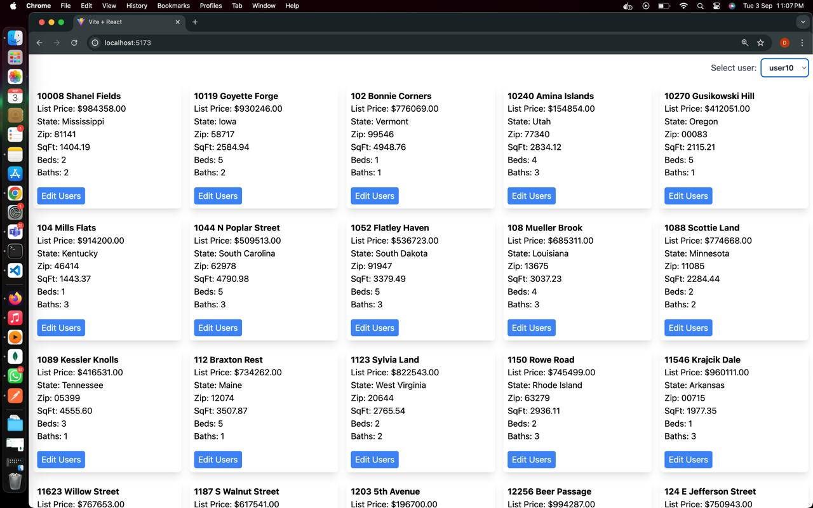
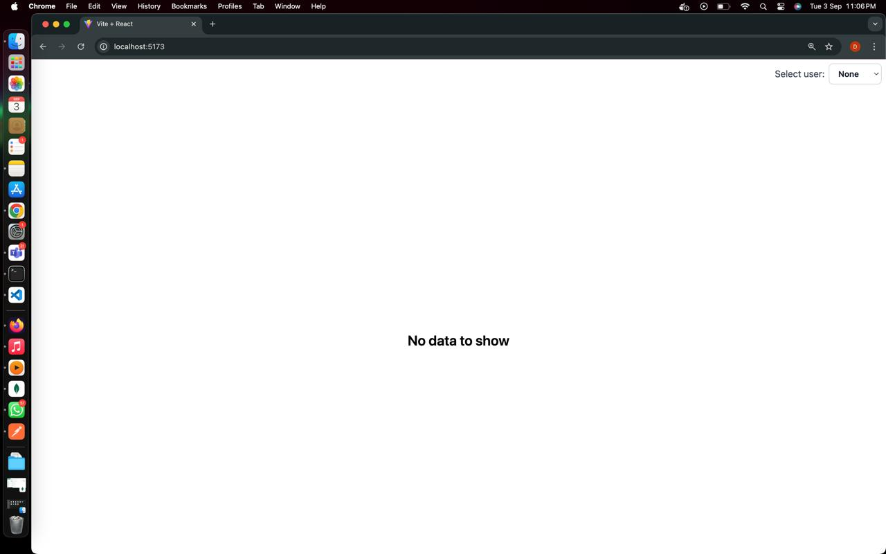
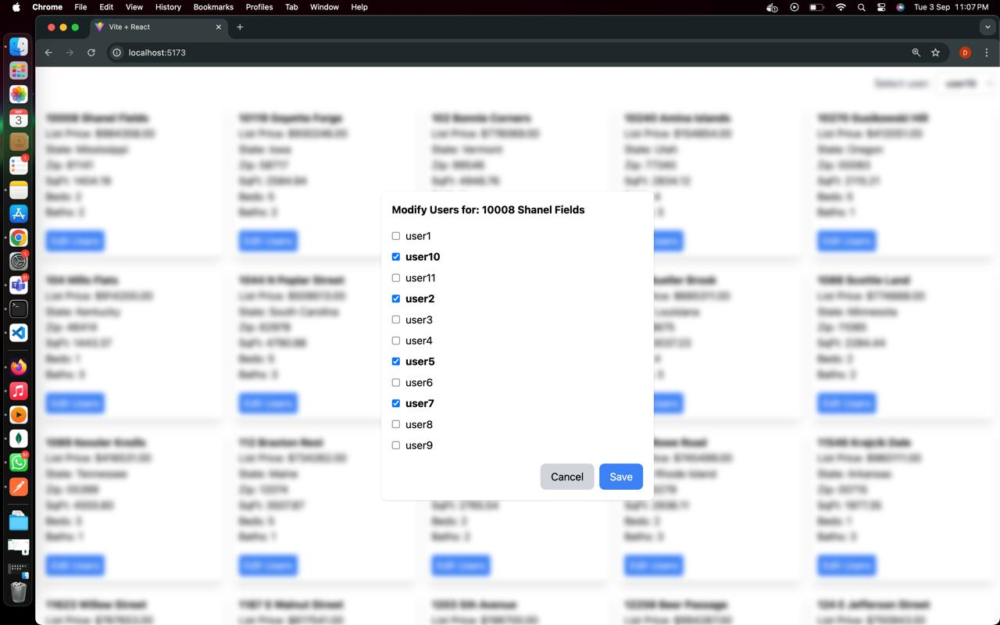

# Home Database Schema

This repository contains SQL scripts to create and populate the `home_db` database. The database consists of three tables: `user`, `home`, and `user_home_relation`, which represent users, homes, and their associations, respectively. The provided script also includes data migration from an existing `user_home` table.

## Table Structure

### 1. `user`

The `user` table stores user information and includes the following fields:

- `username` (VARCHAR(255), PRIMARY KEY): The unique identifier for each user.
- `email` (VARCHAR(255), UNIQUE, NOT NULL): The email address of the user.

### 2. `home`

The `home` table stores information about homes and includes the following fields:

- `street_address` (VARCHAR(255), PRIMARY KEY): The unique address of each home.
- `state` (VARCHAR(100), NOT NULL): The state where the home is located.
- `zip` (VARCHAR(10), NOT NULL): The ZIP code of the home's location.
- `sqft` (DECIMAL(10, 2), NOT NULL): The square footage of the home.
- `beds` (INT, NOT NULL): The number of bedrooms in the home.
- `baths` (INT, NOT NULL): The number of bathrooms in the home.
- `list_price` (DECIMAL(15, 2), NOT NULL): The listing price of the home.

### 3. `user_home_relation`

The `user_home_relation` table establishes a many-to-many relationship between users and homes:

- `username` (VARCHAR(255)): Foreign key referencing the `username` field in the `user` table.
- `street_address` (VARCHAR(255)): Foreign key referencing the `street_address` field in the `home` table.

## SQL Script

### File: `home_db.sql`

The `home_db.sql` script performs the following actions:

1. **Database Selection and Configuration**

   - Selects the `home_db` database.
   - Enables local file loading with `SET PERSIST local_infile = 1;`.

2. **Table Creation**

   - Drops existing `user`, `home`, and `user_home_relation` tables if they exist.
   - Creates new `user`, `home`, and `user_home_relation` tables with the structure described above.

3. **Data Insertion**
   - Inserts distinct user data into the `user` table.
   - Inserts distinct home data into the `home` table.
   - Inserts user-home relationships into the `user_home_relation` table.

# Frontend

1. **Clone the repository:**

   ```bash
   git clone https://github.com/divyendhsuresh/full_stack_assessment_skeleton.git
   cd full_stack_assessment_skeleton/frontend
   ```

## Install dependencies

     - npm install

## To start the development server

    - npm run dev

- Dependencies

  @tanstack/react-query: ^5.53.2
  @tanstack/react-query-devtools: ^5.53.2
  axios: ^1.7.7
  react: ^18.3.1
  react-dom: ^18.3.1

- Dev Dependencies

  ESLint: ^9.9.0 with plugins for React and React Hooks.
  Tailwind CSS: ^3.4.10 for styling.
  Vite: ^5.4.1 for bundling and development.

- webview

  
  
  

# Backend

### Prerequisites

Ensure you have Node.js and npm installed on your machine. You will also need a MySQL database setup.

### Installation1. **Clone the repository:**

```bash
 git clone https://github.com/divyendhsuresh/full_stack_assessment_skeleton.git
 cd full_stack_assessment_skeleton/backend
```

- Install dependencies:

  npm install

- Run the application:

  npm start

- Scripts

  npm start: Starts the application with Nodemon.

- Dependencies

  > Express: Fast, unopinionated, minimalist web framework for Node.js.
  > TypeORM: ORM for TypeScript and JavaScript (ES7, ES6, ES5).
  > Nodemon: A tool that helps develop Node.js applications by automatically restarting the node application when file changes in the directory are detected.
  > Cors: Middleware for enabling Cross-Origin Resource Sharing (CORS).

- screen record

- [watch the video for reference](https://drive.google.com/file/d/1ZqEiis2Jw7CBCRG0X12FJC-wQo4h5BU8/view?usp=drive_link)
